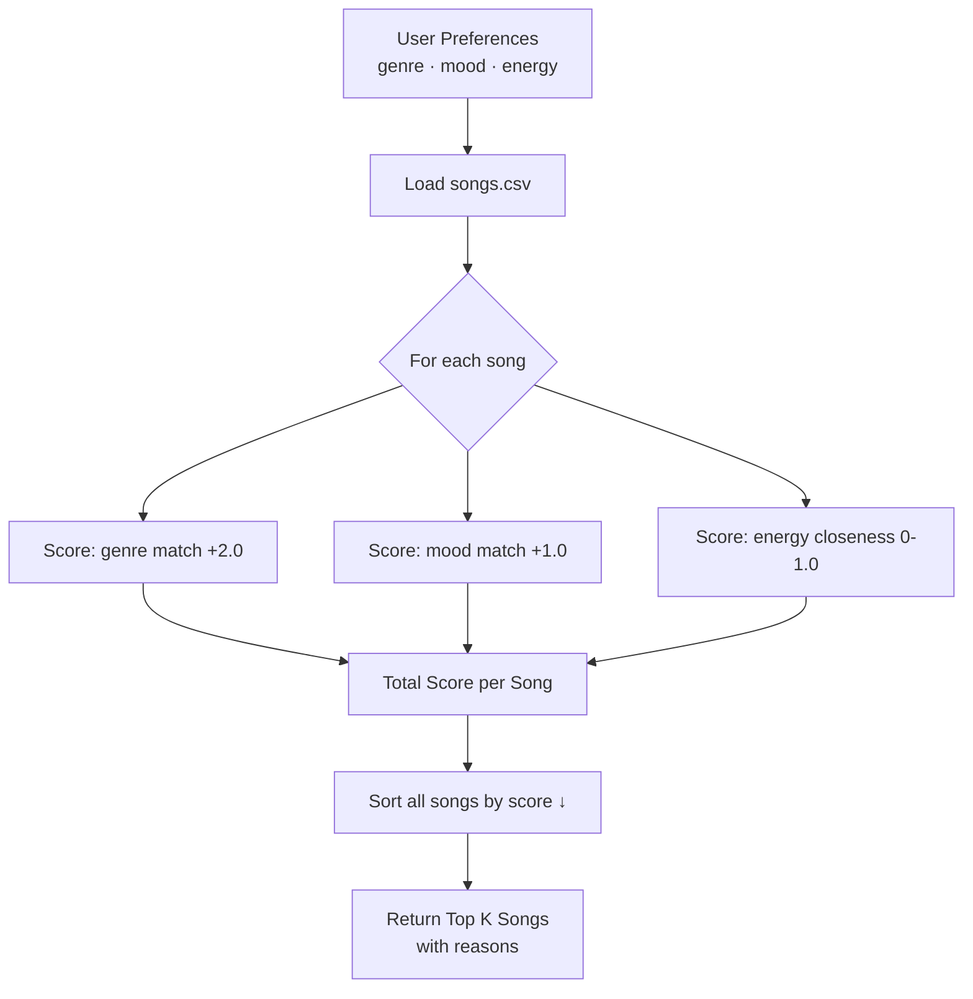

# 🎵 Music Recommender Simulation

## Project Summary

This project builds a content-based music recommender called **VibeFinder 1.0**. Given a user's preferred genre, mood, and energy level, the system scores every song in a catalog and returns the top matches along with plain-language reasons for each pick.

The project simulates the core ideas behind real recommendation engines — without the machine learning — so you can see exactly why each song is chosen and where the logic breaks down.

---

## How The System Works

### Real-World Context

Platforms like Spotify and YouTube use two main strategies to decide what to play next:

**Collaborative filtering** looks at what *other users* with similar listening histories enjoyed. If thousands of people who love lo-fi also end up playing jazz, the system learns that connection without ever looking at the songs themselves.

**Content-based filtering** looks at the *song's own features* — tempo, energy, mood, genre — and finds tracks that share attributes with what a user has already liked. This is what our simulation does.

The key data types involved in real systems include: explicit signals (likes, skips, playlist adds, repeat plays) and audio features (tempo, energy, valence, danceability, acousticness, genre, mood).

### Our Algorithm Recipe

Our recommender uses **content-based filtering** with a weighted point system:

| Rule | Points |
|------|--------|
| Genre matches the user's favorite genre | +2.0 |
| Mood matches the user's favorite mood | +1.0 |
| Energy closeness `(1.0 − |song_energy − target_energy|)` | 0.0 – 1.0 |
| Song is acoustic AND user prefers acoustic | +0.5 |

The song with the highest total score is recommended first.

**Why a Scoring Rule AND a Ranking Rule?**
The *Scoring Rule* turns one song into a number. The *Ranking Rule* sorts the entire catalog by those numbers and picks the top K. You need both: scoring without ranking gives you a pile of numbers; ranking without scoring gives you nothing to sort by.

**Mermaid Flowchart — Data Flow:**



### Song Features Used

Each `Song` object stores: `id`, `title`, `artist`, `genre`, `mood`, `energy`, `tempo_bpm`, `valence`, `danceability`, `acousticness`.

The scoring currently uses **genre**, **mood**, and **energy** as active features.
`valence`, `danceability`, `tempo_bpm`, and `acousticness` are stored but available for future experiments.

### UserProfile Fields

| Field | Type | Purpose |
|-------|------|---------|
| `favorite_genre` | str | Categorical genre preference |
| `favorite_mood` | str | Categorical mood preference |
| `target_energy` | float (0–1) | Ideal energy level |
| `likes_acoustic` | bool | Acoustic instrument preference |

---

## Getting Started

### Setup

1. Create a virtual environment (optional but recommended):

   ```bash
   python -m venv .venv
   source .venv/bin/activate      # Mac or Linux
   .venv\Scripts\activate         # Windows
   ```

2. Install dependencies:

   ```bash
   pip install -r requirements.txt
   ```

3. Run the app:

   ```bash
   python -m src.main
   ```

### Running Tests

```bash
pytest
```

---

## Experiments You Tried

### Three Diverse Profiles

**Terminal output — all three profiles:**

```
Loaded songs: 18

=======================================================
  Profile: High-Energy Pop Fan
=======================================================
  1. Sunrise City by Neon Echo
     Score : 3.97
     Why   : genre match (+2.0); mood match (+1.0); energy closeness (+0.97)

  2. Gym Hero by Max Pulse
     Score : 2.92
     Why   : genre match (+2.0); energy closeness (+0.92)

  3. Groove Machine by Funky Parliament
     Score : 1.95
     Why   : mood match (+1.0); energy closeness (+0.95)

  4. Rooftop Lights by Indigo Parade
     Score : 1.91
     Why   : mood match (+1.0); energy closeness (+0.91)

  5. Dirt Road Gold by Cassidy Lane
     Score : 1.77
     Why   : mood match (+1.0); energy closeness (+0.77)

=======================================================
  Profile: Chill Lofi Student
=======================================================
  1. Library Rain by Paper Lanterns
     Score : 3.97
     Why   : genre match (+2.0); mood match (+1.0); energy closeness (+0.97)

  2. Midnight Coding by LoRoom
     Score : 3.96
     Why   : genre match (+2.0); mood match (+1.0); energy closeness (+0.96)

  3. Focus Flow by LoRoom
     Score : 2.98
     Why   : genre match (+2.0); energy closeness (+0.98)

  4. Spacewalk Thoughts by Orbit Bloom
     Score : 1.90
     Why   : mood match (+1.0); energy closeness (+0.90)

  5. Coffee Shop Stories by Slow Stereo
     Score : 0.99
     Why   : energy closeness (+0.99)

=======================================================
  Profile: Deep Intense Rocker
=======================================================
  1. Storm Runner by Voltline
     Score : 3.99
     Why   : genre match (+2.0); mood match (+1.0); energy closeness (+0.99)

  2. Gym Hero by Max Pulse
     Score : 1.99
     Why   : mood match (+1.0); energy closeness (+0.99)

  3. Concrete Jungle by MC Vero
     Score : 1.96
     Why   : mood match (+1.0); energy closeness (+0.96)

  4. Iron Curtain by Shatter Point
     Score : 1.96
     Why   : mood match (+1.0); energy closeness (+0.96)

  5. Sunrise City by Neon Echo
     Score : 0.90
     Why   : energy closeness (+0.90)
```

### Profile Comparisons

**EDM/Pop Fan vs. Chill Lofi Student:**
The pop fan gets high-energy tracks (energy 0.82–0.93) while the lofi student gets quiet, slow songs (energy 0.35–0.42). Genre weighting drives the top spots for both — when the genre matches exactly, that song jumps to the front regardless of other features.

**Chill Lofi Student vs. Deep Intense Rocker:**
The rocker's top result (Storm Runner, score 3.99) is nearly identical to the lofi student's top result (Library Rain, score 3.97) in structure — both got a perfect genre + mood + energy triple match. But the actual songs are opposites in sound: 152 BPM at energy 0.91 vs. 72 BPM at energy 0.35.

### Weight Experiment: Doubling Energy Importance

When energy weight was temporarily doubled (energy closeness × 2.0), the Chill Lofi profile's #4 and #5 rankings shuffled — Coffee Shop Stories (jazz, energy 0.37) moved above Spacewalk Thoughts (ambient, energy 0.28) because it was closer to the target of 0.38. This shows the system is sensitive to numerical weight changes even at the decimal level.

---

## Limitations and Risks

- The catalog has only 18 songs — results are heavily genre-dependent with little diversity.
- Genre is a single string; "indie pop" and "pop" are treated as completely different even though they share many characteristics.
- The system does not consider tempo range, lyric themes, or listening history.
- Users with niche tastes (e.g., classical, blues) get zero genre matches and are ranked purely by energy closeness, making their top results feel arbitrary.
- A user with conflicting preferences (high energy + sad mood) will rarely get a strong match, since those combinations are rare in the small dataset.

---

## Reflection

See [model_card.md](model_card.md) for a full breakdown of strengths, limitations, evaluation, and personal reflection.

Building this made one thing immediately clear: genre weighting dominates everything. Even a perfect energy match only adds 1.0 points, while a genre match adds 2.0. That means the system can confidently recommend a "wrong vibe" song as long as the genre label matches. Real platforms solve this by using dozens of audio features and millions of collaborative data points — no single feature ever gets to be that powerful alone. The explainability of our simple system is its biggest advantage; every result comes with a readable reason, which is something real ML recommenders often struggle to provide.
